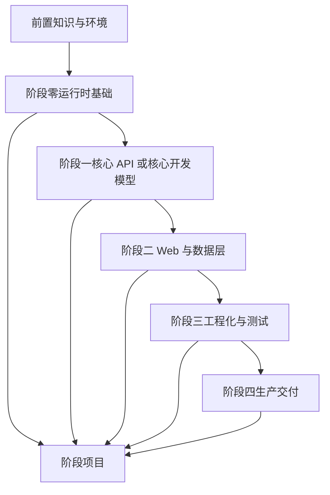

# Node.js 与 NestJS 新手学习路线重构设计

Feature Name: nodejs-nestjs-beginner-learning-redesign
Updated: 2026-08-26

## Description

重构两套服务端学习文档的导航和实践结构，让学习者能够沿着“理解概念 -> 完成最小练习 -> 扩展综合项目 -> 验收能力”的路径学习。已有阶段文章保留为知识正文，新增加的导读和项目章节负责串联内容。

## Architecture



Node.js 路线先建立运行时和原生 HTTP 心智模型，再引入服务分层。NestJS 路线先解释框架启动和依赖注入，再解释请求生命周期和企业能力。两条路线通过桥接章节共享概念词汇。

## Components and Interfaces

| 文档组件 | 责任 |
| --- | --- |
| Node.js 新手导读 | 环境、顺序、阶段产出、学习方法和排错 |
| Node.js 阶段项目 | 按阶段扩展原生 HTTP 用户 API |
| NestJS 新手导读 | 框架心智模型、CLI、阶段产出和排错 |
| NestJS 阶段项目 | 按阶段扩展模块化用户权限 API |
| Node.js/NestJS 桥接 | 对比原生实现与框架抽象 |
| 现有 stage 文档 | 提供 API、架构、工程化和生产主题参考 |

每个新手导读章节采用统一结构：目标、前置条件、学习顺序、最小练习、阶段产出、验收标准、常见错误和下一步。

## Data Models

阶段任务使用以下统一字段描述：

```text
StageTask {
  title: string
  prerequisites: string[]
  questions: string[]
  actions: string[]
  output: string
  checks: string[]
}
```

综合项目使用同一业务主题“用户管理与权限”，Node.js 强调原生运行时和分层，NestJS 强调模块、依赖注入和请求生命周期。

## Correctness Properties

1. 每个阶段都有前置条件、阶段产出和验收项。
2. 每个导航链接都指向仓库内存在的 Markdown 文件。
3. 每个代码示例都标明其为概念片段或项目实现片段。
4. Node.js 与 NestJS 的同名概念使用一致定义。
5. 文档中的命令、路径和版本建议不会暴露凭证。

## Error Handling

- 环境命令失败：先确认 Node.js 版本、包管理器、工作目录和锁文件。
- 模块导入失败：检查 ESM/CommonJS 配置、文件扩展名和导入路径。
- NestJS 依赖解析失败：检查模块 `imports`、Provider `providers` 和 `exports`。
- 请求返回异常：按输入校验、认证授权、业务错误、数据库错误和未知错误分层排查。
- 示例无法直接运行：在文档中明确所需依赖、文件上下文和 Mock 边界。

## Test Strategy

- 使用 `git diff --check` 检查 Markdown 空白错误。
- 检查新增导航链接的目标文件存在。
- 检查代码围栏数量为偶数。
- 检查 README 是否包含阶段顺序、项目入口和验收路径。
- 对综合项目中的命令和代码做人工一致性审阅。
